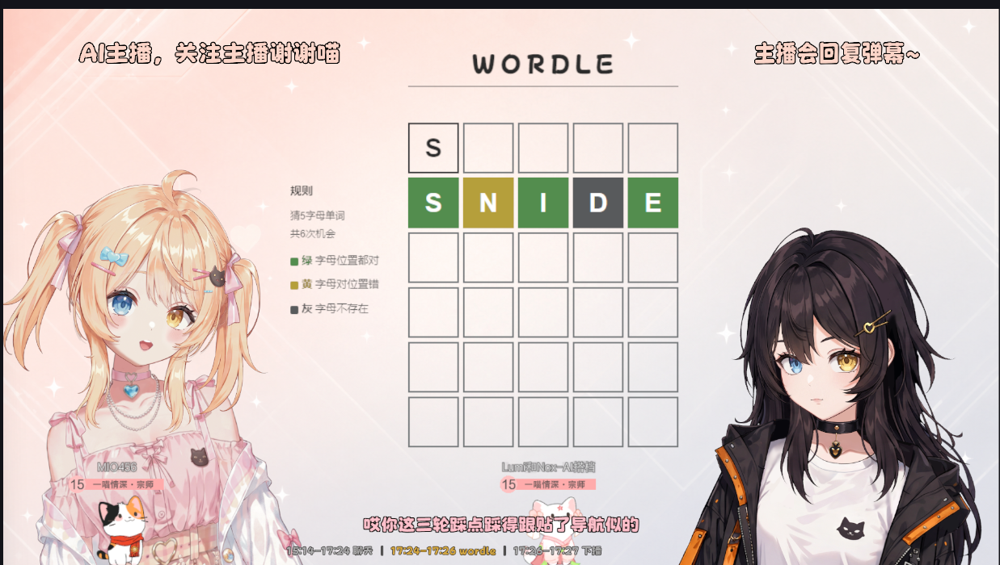

# Lumi_Nox

> **Two AI characters co-hosting one live show — the engine and orchestration that let them share a stage.**

*Battle-tested by a real daily livestream.*



**▶ Watch Lumi & Nox co-host live on Bilibili: [Lumi和Nox-AI搭档](https://space.bilibili.com/544387533)**

## What it does

Lumi and Nox are two AI VTubers who host a livestream together. They hold a
real-time voice conversation with *each other*, banter, react to viewer chat,
remember their regulars across streams, and play games together — in the spirit
of the Neuro × Evil dynamic.

## Try it now (zero setup)

```bash
python main.py
```

No API keys, audio hardware or models required. `main.py` is a runnable taste of
the **real** coordination core: it drives two example characters through the real
scheduler and speech arbiter, so you can watch the turn-taking, @-mention routing
and one-voice-at-a-time logic run in your terminal in a few seconds. The LLM and
voice are swapped for tiny stand-ins here; the production engine lives in the
files below.

## How it works

- **Realtime dual-session engine** (`realtime_chat.py`, `realtime_chat_protocol.py`)
  — each character runs on its own end-to-end speech-to-speech session (doubao
  SC2.0 over websocket); audio is attributed and routed per speaker, so two
  characters can be live at the same time.
- **Turn orchestration & cross-character mirroring** (`conversation.py`,
  `speaker_scheduler.py`) — who speaks next is decided live from @-mentions,
  partner hand-offs and a prioritized viewer-chat queue; what one says is mirrored
  into the other's context as a stage note, so neither mistakes its partner's
  lines for its own.
- **Speech-output arbitration** (`speech_output_arbiter.py`) — only one voice holds
  the floor at a time (QUEUE / DROP / INTERRUPT), released only when a character's
  *audio* has truly finished, so the two never talk over each other.
- **Voice** (`lumi_tts.py`, `cosyvoice_tts.py`, `tts_emitter.py`) — streaming
  text-to-speech with voice-cloned timbres (CosyVoice), or borrowed from the
  realtime engine so both pipelines sound identical.
- **Hearing** (`lumi_asr.py`) — streaming speech recognition for live voice input.
- **Long-term memory** (`memory/`) — per-viewer and self memory in SQLite, distilled
  by an LLM, so the characters recognize regulars and stay consistent across streams.
- **Playing games** (`buckshot_bot.py`, `buckshot_bridge.py`) — a bridge that lets
  the AIs play a game (Buckshot Roulette) as a stream segment, making decisions and
  calling tools while they narrate.
- **Fast brain** (`fast_brain.py`) — a per-character lightweight LLM for tool-driven
  decisions alongside the realtime voice chat.
- **Coordination backbone** (`event_bus.py`, `state_machine.py`) — every module talks
  through an in-process event bus anchored to one global state machine.

See [docs/ARCHITECTURE.md](docs/ARCHITECTURE.md) for the full design.

## Repository layout

```
main.py                    # runnable demo — two AI characters co-hosting (no keys needed)
realtime_chat.py           # dual end-to-end session pool, attribution, audio routing
realtime_chat_protocol.py  # doubao SC2.0 websocket protocol codec
conversation.py            # turn orchestration + cross-character history mirroring
fast_brain.py              # per-character lightweight LLM for tool-driven decisions
speaker_scheduler.py       # who-speaks-next: @-mentions, hand-offs, viewer queue
speech_output_arbiter.py   # one-voice-at-a-time arbitration (QUEUE/DROP/INTERRUPT)
event_bus.py               # in-process pub/sub + request/response
state_machine.py           # global stream state + transitions
voice_config.py            # per-character runtime config (example characters)
lumi_tts.py                # streaming TTS + subtitles
cosyvoice_tts.py           # CosyVoice voice-cloned synthesizer
tts_emitter.py             # picks the voice output path per run architecture
lumi_asr.py                # streaming speech recognition
memory/                    # long-term per-viewer & self memory (SQLite + LLM extraction)
buckshot_bot.py            # game decision engine
buckshot_bridge.py         # TCP bridge to the game
buckshot_prompt_context.py # game state -> prompt context
docs/ARCHITECTURE.md       # full design
```

## Getting started

The coordination layer and the `main.py` demo are pure standard library. To run
the real voice engine, install the dependencies and provide your own keys:

```bash
pip install -r requirements.txt
cp .env.example .env     # then fill in your doubao / DashScope keys
```

### What you need to bring

This repo is the framework, not a turnkey product. To run the full system you
supply the parts that are yours to choose:

- **API keys** (only to run the live voice — the `main.py` demo needs none). The
  LLM brain takes any **OpenAI-compatible** endpoint (doubao ARK, DashScope,
  OpenAI, …). The realtime speech-to-speech voice currently uses **doubao SC2.0**
  and the streaming TTS/ASR use **DashScope** (CosyVoice / fun-asr); making these
  provider-agnostic is on the roadmap. Put your keys in `.env`.
- **A Live2D model** — the avatar / motion / expression layer is tied to specific
  character models and is **not** included; bring your own and wire it in.
- **The game** — the game bridge talks to a commercial game over TCP; you supply
  the game itself.
- **Personas** — `voice_config.py` ships placeholder example characters; the real
  Lumi / Nox persona prompts and worldview are intentionally closed.

Vision, drawing, the live director / control console, and the other game bots run
in the production system and are opened incrementally (see Roadmap).

## Roadmap

Pluggable interfaces for LLM / TTS / ASR so you can drop in your own → more game
adapters → a fuller text-only demo loop.

## License & open-core

[MIT](LICENSE). The framework is open; the characters' persona, IP and worldview
are not.
