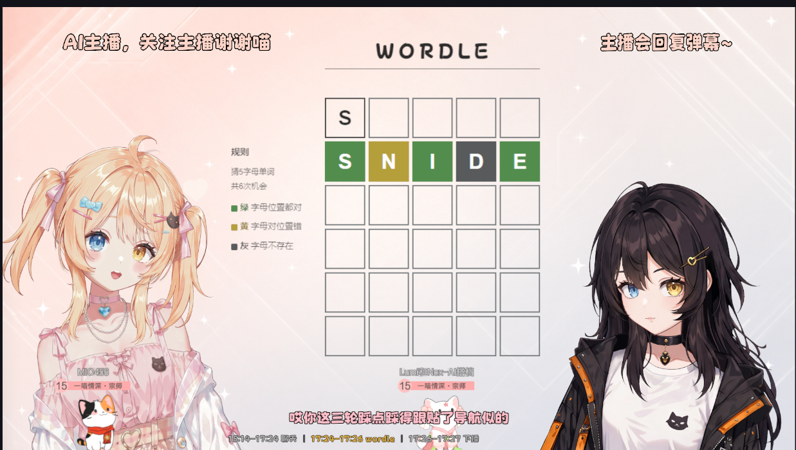

# Lumi_Nox

**中文 | [English](README.en.md)** · [快速开始](docs/GETTING_STARTED.md) · [如何贡献](CONTRIBUTING.md) · [可以一起做什么](docs/CONTRIBUTION_TASKS.md)

> 两位 AI 主播，共同主持一场直播。这里分享让她们轮流接话、回应观众和参与游戏的部分工程实现。

[](https://github.com/MIO-456/Lumi_Nox/actions/workflows/ci.yml)
[](https://github.com/MIO-456/Lumi_Nox/releases)
[](LICENSE)



**▶ 观看实际直播与视频：[Lumi和Nox-AI搭档](https://space.bilibili.com/544387533)**

## 这是什么项目

Lumi 和 Nox 是共同主持直播的两位 AI 虚拟主播。项目围绕双角色对话、观众互动、语音、记忆和游戏展开：观众点名时由谁回应，两人怎样接话，游戏决策怎样与说话配合，都是这里关心的工程问题。

这个仓库是项目的 **open-core（核心源码公开）**：收录从实际直播系统整理的模块和工程资料，按阶段发布。首页画面展示实际节目，下面的终端演示带你了解双角色调度。

## 先跑一次：无需密钥的终端演示

准备 Python 和 Git。**Python 3.12 是已验证的基线，也是当前 CI 使用的版本。**

```bash
git clone https://github.com/MIO-456/Lumi_Nox.git
cd Lumi_Nox
python main.py
```

macOS / Linux 如果使用 `python3` 命令，请将最后一行改为 `python3 main.py`。更详细的下载、运行和检查步骤见[快速开始](docs/GETTING_STARTED.md)。

这条路径只用 Python 标准库，**不需要先安装 `requirements.txt`，也不需要 API Key、模型、声卡或游戏**。几秒后会看到 `=== demo complete ===`。

- **真实运行的部分**：事件总线、状态机、发言调度器和语音输出仲裁器；可以观察点名路由、轮换和占用发言权时的排队。
- **演示占位的部分**：`DemoBrain` 返回固定台词；`demo_speak()` 只打印文字，**终端无声**。演示会自动跑完，不接收你手动输入的弹幕，也不连接直播间。

## 项目特点与当前公开模块

| 关注的问题 | 公开实现 | 从哪里看 |
|---|---|---|
| 两位角色怎样轮流接话 | 点名路由、观众消息队列、轮换与跨角色历史镜像 | [core/speaker_scheduler.py](core/speaker_scheduler.py)、[dialogue/conversation.py](dialogue/conversation.py) |
| 怎样避免同时占用语音输出 | 发声前申请、完成后释放，支持排队、丢弃和打断策略 | [core/speech_output_arbiter.py](core/speech_output_arbiter.py) |
| 模块怎样共享节目状态 | 进程内事件总线与全局状态机 | [core/event_bus.py](core/event_bus.py)、[core/state_machine.py](core/state_machine.py) |
| 怎样接入模型与语音 | 文本快脑、双角色实时语音会话、流式 TTS 与 ASR | [dialogue/fast_brain.py](dialogue/fast_brain.py)、[audio/realtime_chat.py](audio/realtime_chat.py)、[audio/lumi_tts.py](audio/lumi_tts.py)、[audio/lumi_asr.py](audio/lumi_asr.py) |
| 怎样独立接入 Qwen 合成与播放 | 整句 PCM、播放结果、取消与分角色音量 | [语音模块指南](docs/VOICE_MODULES.md)、[audio/qwen3_tts.py](audio/qwen3_tts.py) |
| 怎样延续观众与角色的记忆 | SQLite 存储、事实提取、确定性事实与时间衰减 | [memory/](memory/) |
| 怎样让 AI 参与游戏 | 恶魔轮盘、泰拉瑞亚、王国保卫战、Wordle、汉兜的桥接与决策代码 | [游戏入口与说明](games/README.md) |

游戏模块包含泰拉瑞亚的 A* 寻路、目标规划与 tModLoader 模组，王国保卫战的 Lua 桥接与逐波策略，以及在独立进程中执行搜索的词语游戏求解器。各模块的使用条件不同，具体见对应指南。

深入模型、语音和游戏模块时，再按对应指南准备服务、依赖、设备或游戏环境，并完成模块接线。

## 可以一起做什么

我们优先欢迎能让节目更有意思的技术贡献：**接入一款新游戏、尝试绘画的新表现形式、探索角色点唱**。这些是待讨论的方向；点唱可以从已有角色曲库入手，也可以探索按请求制作新的演唱版本，具体路线尚待讨论。先展示独立原型、效果和可行性，再确定接入范围。[最小接口、样本与离线演示](docs/PROTOTYPE_INTERFACES.md)已提供；正式直播接线和实机验收由维护者负责。

也欢迎从小处开始：给终端演示增加可选的手动输入，复现一个问题，在自己的系统上跑一次上手指南，或为公开模块写一篇教程。不需要先加入团队。

- [可以一起做什么](docs/CONTRIBUTION_TASKS.md)：查看方向、可独立开始的任务和交付要求。
- [如何贡献](CONTRIBUTING.md)：了解提出建议、提交问题与 PR 的流程。
- [Issues](https://github.com/MIO-456/Lumi_Nox/issues)：查找已有讨论，或带着复现步骤、原型和具体想法发起交流。

## 阅读路线与技术资料

先运行 [main.py](main.py)，再按[快速开始中的读代码路线](docs/GETTING_STARTED.md#5-下一步读哪些代码)看调度器和仲裁器。深入某个子系统时可以参考：

- [整体架构与数据流](docs/ARCHITECTURE.md)
- [本次源码更新与验证范围](docs/releases/2026-11-12-source-refresh.md)
- [独立语音模块与配置](docs/VOICE_MODULES.md)
- [游戏目录与入口](games/README.md)
- [泰拉瑞亚模组安装与后台控制说明](games/terraria/mod/README.md)
- [泰拉瑞亚行为树设计](docs/games/terraria-behavior-tree.md)
- [王国保卫战逆向工程记录](docs/games/kingdom-rush-reverse-engineering.md)
- [发布记录](https://github.com/MIO-456/Lumi_Nox/releases)

```text
main.py                   # 标准库终端演示
core/                     # 事件、状态、角色调度和语音仲裁
dialogue/                 # 对话编排、模型调用、观众名称和联网搜索
audio/                    # ASR、TTS、实时语音与播放处理
settings/                 # 示例角色配置与音色适配
interfaces/               # 游戏规则、画板消息和歌曲资产契约
examples/                 # 无需密钥的原型数据与临时音轨样本
memory/                   # 记忆存储、提取与衰减
games/                    # 游戏桥接与决策
tests/                    # 无外部服务的公开核心检查
docs/                     # 上手、架构与模块指南
```

从旧版本更新的调用者，见[目录迁移与导入对照](docs/PACKAGE_LAYOUT.md)。

## 检查运行结果

在仓库根目录运行；macOS / Linux 按需使用 `python3`：

```bash
python main.py
python -m unittest discover -s tests -v
python -m compileall -q .
```

演示应正常结束，测试应显示 `OK`，编译检查成功时通常没有输出。GitHub Actions 在每次 push 和 PR 中使用 Ubuntu / Python 3.12，直接执行编译与 unittest；其中 `test_zero_setup_demo` 会调用 `main.py`。这些检查验证公开核心，不代表真实语音、游戏或整场直播已经验收。

## 公开范围与许可

代码沿用 [MIT 许可证](LICENSE)。角色的真实人设、世界观、角色 IP、声纹与私有音色 ID，以及观众数据库、运行日志和运营资料不在公开范围。Live2D 模型、动作与表情层、视觉、绘画和直播导演／中控台也未包含在这个仓库中；商业游戏本体需自行准备。

`settings/voice_config.py` 提供占位角色配置，`settings/voice_registry.py` 可读取使用者自己的音色变量；具体接入请参考 [.env.example](.env.example) 和对应模块。请使用自己的模型、角色与获准使用的声音素材，真实密钥仅保存在本地。

新增公开模块会先核对隐私、许可与依赖边界；贡献的评审与采用流程见[贡献指南](CONTRIBUTING.md)。
